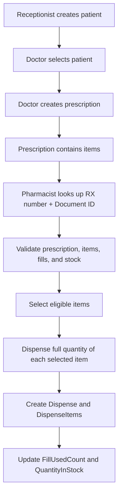
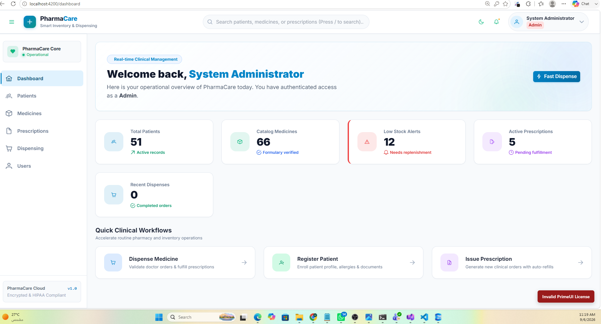
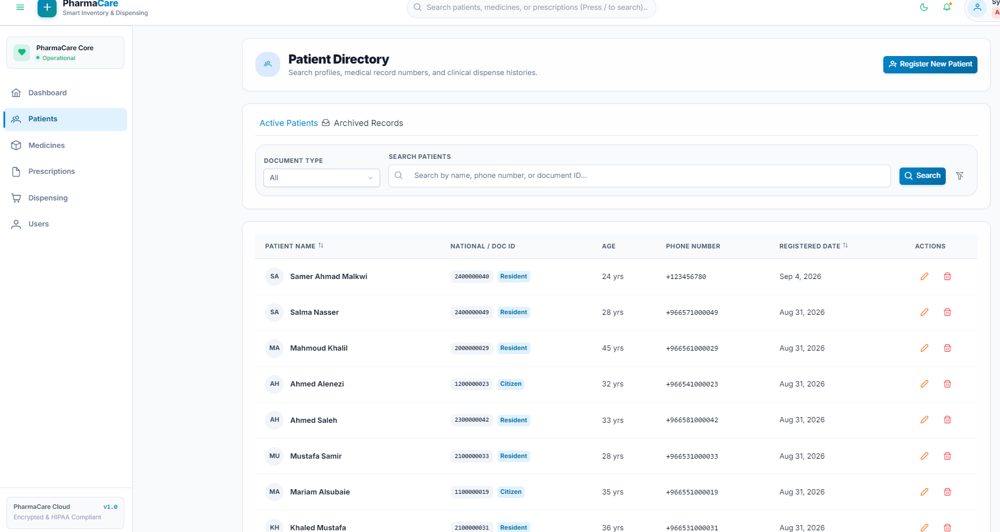
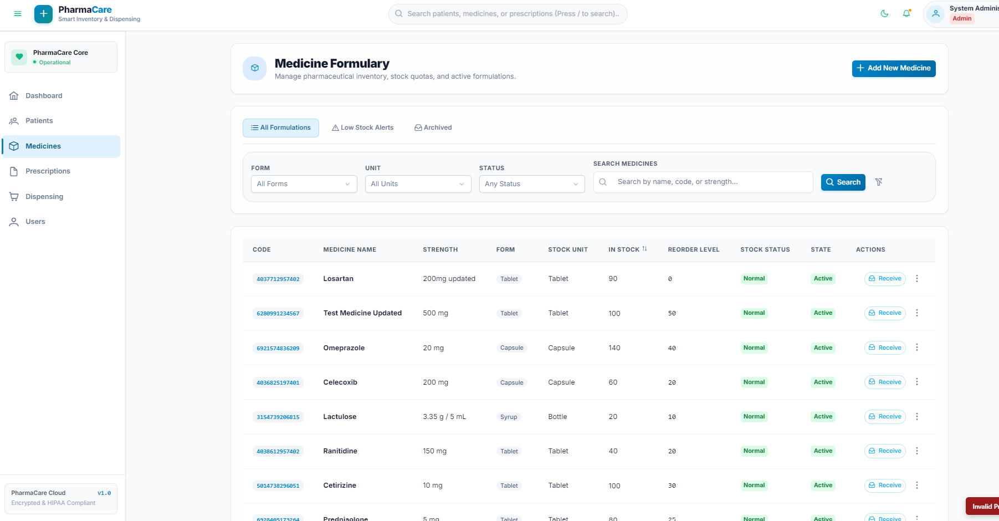
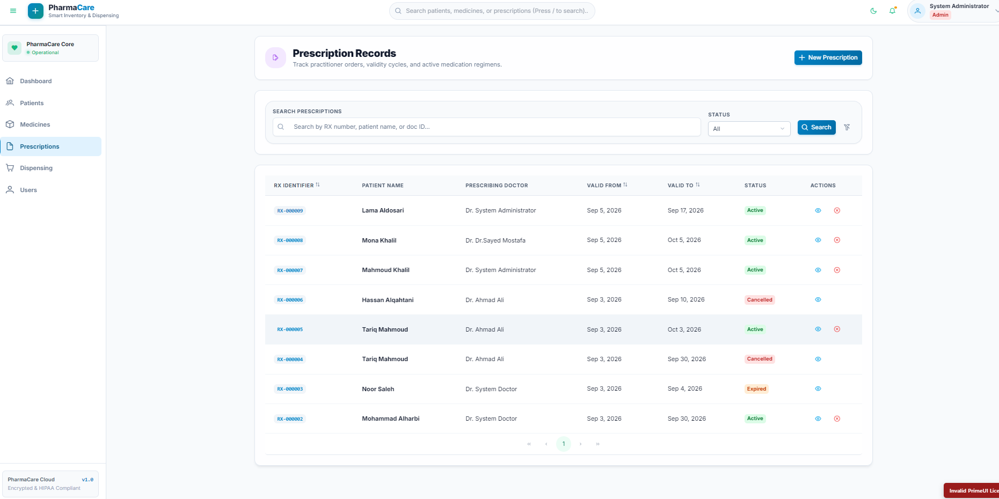
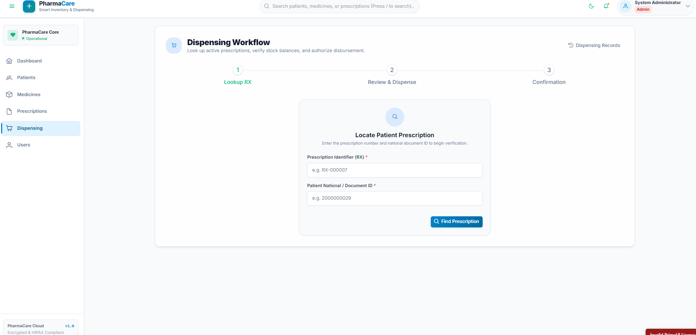
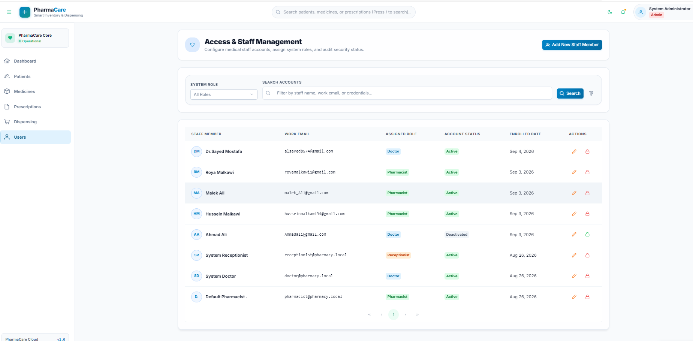
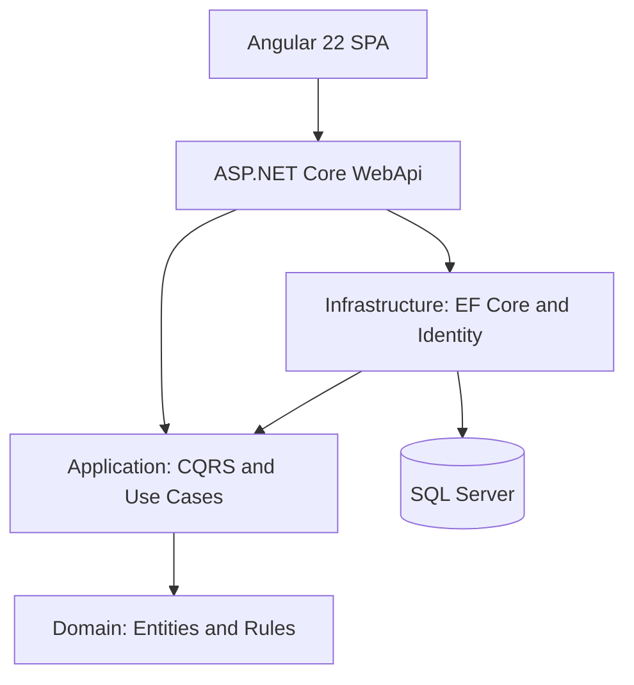

# PharmaCare — Pharmacy Inventory & Dispensing System

PharmaCare is a full-stack pharmacy workflow application for managing patients, medicines, prescriptions, dispensing, staff users, and role-aware dashboard statistics. The core workflow is: a receptionist registers a patient, a doctor creates a prescription, and a pharmacist validates and dispenses eligible prescription items while the system updates stock and refill counts.

## Project Scope

The system supports:

- Patient management
- Medicine catalog management
- Medicine image upload, replacement, and display with file type/size validation
- Simple medicine stock quantities and low-stock warnings
- Prescription creation by doctors
- Prescription items with independent fill rules
- Prescription lookup using prescription number and patient document ID
- Prescription validation before dispensing
- Item-level partial dispensing
- Independent fill tracking for each prescription item
- Dispensing records and history
- Role- and permission-based access
- Consistent API responses and error handling

## Core Business Workflow



Partial dispensing is supported by selecting only eligible prescription items. The quantity of each selected item must still equal its complete `QuantityPrescribed` value.

## Screenshots

### Dashboard



### Patients



### Medicines



### Prescriptions



### Dispensing



### User Management



## Tech Stack

| Area | Technology | Version |
| --- | --- | ---: |
| Backend | .NET SDK / ASP.NET Core | 10.0.400 / 10 |
| Data access | Entity Framework Core | 10.0.11 |
| Database | SQL Server Express | 2022 — 16.0.1000.6 RTM |
| API documentation | Scalar.AspNetCore | 2.17.1 |
| API versioning | Asp.Versioning | 10.2.x |
| Frontend | Angular Core / Angular CLI | 22.1.4 / 22.1.6 |
| UI library | PrimeNG | 22.1.0 |
| Styling | Tailwind CSS | 3.4.19 |
| Language | TypeScript | 6.0.3 |
| Runtime | Node.js / npm | 24.20.0 / 11.19.0 |

The backend also uses Clean Architecture, CQRS with MediatR, FluentValidation, ASP.NET Core Identity, JWT authentication, repository and Unit of Work patterns, structured logging, and policy-based authorization.

## Architecture

The solution follows Clean Architecture. Domain contains business entities and rules. Application contains use cases, interfaces, DTOs, validators, and handlers. Infrastructure implements persistence, Identity, email, repositories, and background services. WebApi exposes the application through secured HTTP endpoints. The Angular SPA consumes the API.



More diagrams:

- [Entity Relationship Diagram](docs/ERD.md)
- [Prescription State Machine](docs/StateMachine.md)
- [Functional and Non-functional Requirements](docs/Requirements.md)

## Prerequisites

Install the following:

- Git
- .NET SDK `10.0.400`
- Node.js `24.20.0` (LTS) and npm `11.19.0`
- SQL Server 2022 Express (`16.0.1000.6` or compatible SQL Server 2022 edition)
- Optional: SQL Server Management Studio

## Setup — Backend

### 1. Clone and enter the backend solution

```bash
git clone https://github.com/mohammadmalkawi2002/-Pharmacy-Inventory-Dispensing-System.git Pharmacy-Inventory-Dispensing-System
cd Pharmacy-Inventory-Dispensing-System/Pharmacy-Inventory-Dispensing-App
dotnet restore
```

### 2. Configure local settings and secrets

Initialize user secrets for the WebApi project:

```bash
dotnet user-secrets init --project src/PharmacyInventoryDispensingSystem.WebApi/PharmacyInventoryDispensingSystem.WebApi.csproj
```

Add the real values required by your local environment and store sensitive values in .NET User Secrets rather than committing them. Configure:

- `ConnectionStrings:DefaultConnection`
- `Jwt:Issuer`
- `Jwt:Audience`
- `Jwt:SigningKey`
- `Jwt:AccessTokenMinutes`
- `Jwt:RefreshTokenDays`
- `Authentication:FrontendUrl`
- `SmtpSettings` values when testing password-reset email

Use the matching structure in `appsettings.json` as a reference. `appsettings.Development.json` is excluded from Git and may also be used for non-committed local development configuration. Change the SQL Server name when your instance is not the default local instance. Gmail SMTP requires an App Password rather than the normal account password.

### 3. Create/update the database

Install the matching EF Core CLI tool if it is not already installed:

```bash
dotnet tool install --global dotnet-ef --version 10.0.11
```

Apply migrations:

```bash
dotnet ef database update --project src/PharmacyInventoryDispensingSystem.Infrastructure --startup-project src/PharmacyInventoryDispensingSystem.WebApi
```

### 4. Run the backend

```bash
dotnet run --project src/PharmacyInventoryDispensingSystem.WebApi
```

The HTTPS API runs locally at `https://localhost:7036` with the included development launch profile.

## Setup — Frontend

Open a second terminal from `Pharmacy-Inventory-Dispensing-App`:

```bash
cd Client/angular-app
npm ci
npm start
```

If npm reports that install scripts for `esbuild` or `@parcel/watcher` require approval, run:

```bash
npm install-scripts approve esbuild
npm install-scripts approve @parcel/watcher
npm rebuild esbuild @parcel/watcher
npm start
```

The frontend runs at [http://localhost:4200](http://localhost:4200). Both Angular environment files currently use:

```typescript
apiUrl: 'https://localhost:7036'
```

Update `src/environments/environment.ts` for a deployed API.

## Default Seeded Accounts

These accounts are created by the development database seeder:

| Role | Email | Password |
| --- | --- | --- |
| Admin | `mohammadmalkawi681@gmail.com` | `Admin@123!` |
| Doctor | `doctor@pharmacy.local` | `User#12345!` |
| Pharmacist | `pharmacist@pharmacy.local` | `User#12345!` |
| Receptionist | `receptionist@pharmacy.local` | `User#12345!` |

> These credentials are for local development only. Replace them before any real deployment.

## API Documentation

After starting the backend, open the Scalar API documentation:

- [https://localhost:7036/scalar/](https://localhost:7036/scalar/)

The API is versioned under `/api/v1`.

## Folder Structure

```text
Pharmacy-Inventory-Dispensing-System/
├── README.md
├── docs/
│   ├── images/
│   ├── ERD.md
│   ├── StateMachine.md
│   └── Requirements.md
└── Pharmacy-Inventory-Dispensing-App/
    ├── src/
    │   ├── PharmacyInventoryDispensingSystem.Domain/
    │   ├── PharmacyInventoryDispensingSystem.Application/
    │   ├── PharmacyInventoryDispensingSystem.Infrastructure/
    │   └── PharmacyInventoryDispensingSystem.WebApi/
    └── Client/
        └── angular-app/
```

- **Domain:** entities, enums, domain rules, and domain errors; no dependency on other layers.
- **Application:** CQRS commands/queries, handlers, DTOs, validation, mappings, and interfaces; depends on Domain.
- **Infrastructure:** EF Core, SQL Server repositories, Identity, migrations, email, file storage, seeding, and background services; implements Application interfaces.

- **WebApi:** controllers, middleware, API versioning, OpenAPI/Scalar, and dependency registration.
- **Client/angular-app:** Angular standalone SPA, feature pages, authentication state, guards, interceptors, and permission-aware UI.

## Known Issues

- The application is configured for local development and is not currently deployed.
- SMTP password-reset email requires valid provider credentials and network access.
- The Angular build reports a few non-blocking warnings for unused imports and redundant null checks.
- Automated unit, integration, and end-to-end test coverage can be expanded.

## Future Improvements

- Docker and Docker Compose so the API, SQL Server, and Angular application can run with one command.
- SignalR real-time notifications.
- Redis caching or output caching for read endpoints.
- Excel and PDF export.
- Localization for English and Arabic, including RTL support.

## Out of Scope

- Batch-level inventory, medicine expiry allocation, FEFO, and stock-movement accounting are intentionally outside the current simplified scope.
