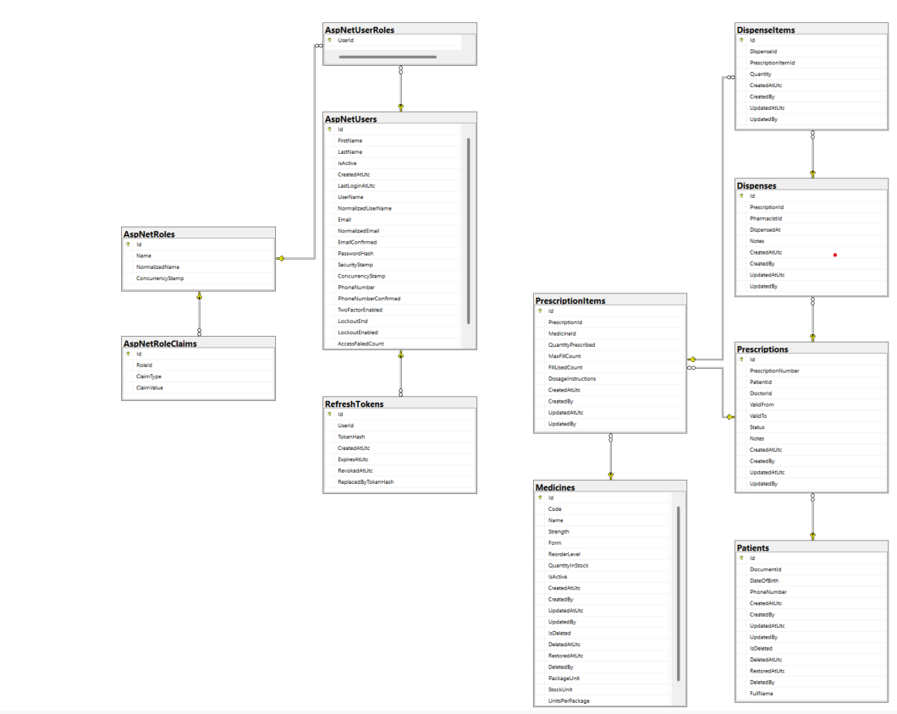

# Entity Relationship Diagram

The following ERD represents the main domain and ASP.NET Core Identity tables used by PharmaCare.

## Main Relationships

| Parent | Relationship | Child |
|---|---|---|
| Patient | One-to-many | Prescriptions |
| Prescription | One-to-many | PrescriptionItems |
| Medicine | One-to-many | PrescriptionItems |
| Prescription | One-to-many | Dispenses |
| Dispense | One-to-many | DispenseItems |
| PrescriptionItem | One-to-many | DispenseItems |
| AspNetUsers | Many-to-many through AspNetUserRoles | AspNetRoles |
| AspNetUsers | One-to-many | RefreshTokens |
| AspNetRoles | One-to-many | AspNetRoleClaims |

## Identity References

`Prescription.DoctorId` and `Dispense.PharmacistId` store ASP.NET Core Identity user IDs. They are logical references without database foreign-key relationships. This keeps Domain entities independent from the Infrastructure Identity implementation.

## Archive Behavior

Patients, medicines, and prescriptions use soft deletion. Global EF Core query filters exclude archived records from normal application queries while preserving historical records and dispensing data.

