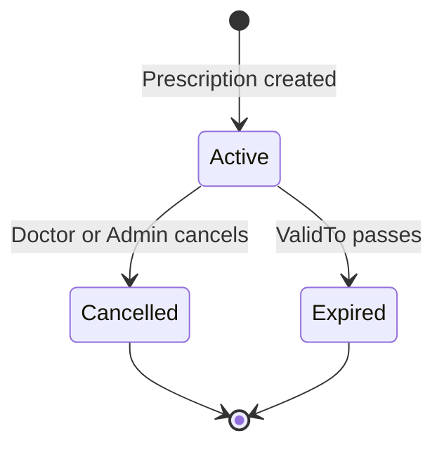

# Prescription State Machine

A prescription is created in the `Active` state. It can then be cancelled explicitly or expire when its validity end date passes.

## Transitions

| Current state | Event | Next state | Rule |
|---|---|---|---|
| New | Successful creation | Active | The server generates the prescription number and assigns the doctor. |
| Active | Cancel command | Cancelled | Allowed to an authorized owner doctor or administrator. |
| Active | `ValidTo` passes | Expired | A background service persists the expired state. |

## Invariants

- Only a prescription whose status is `Active` can be dispensed.
- The current date must also fall between `ValidFrom` and `ValidTo`; runtime date validation remains required even when expiration is persisted.
- A cancelled prescription must never be changed to expired by the expiration background service.
- Cancelled and expired prescriptions remain stored for audit and history.
- Dispensing does not directly change prescription status.
- Fill usage is tracked independently for each `PrescriptionItem` through `FillUsedCount` and `MaxFillCount`.

